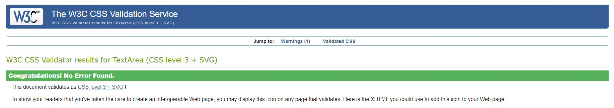
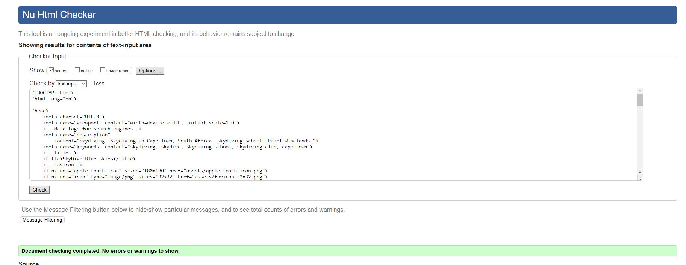
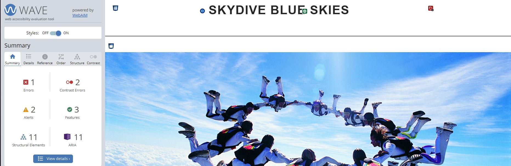
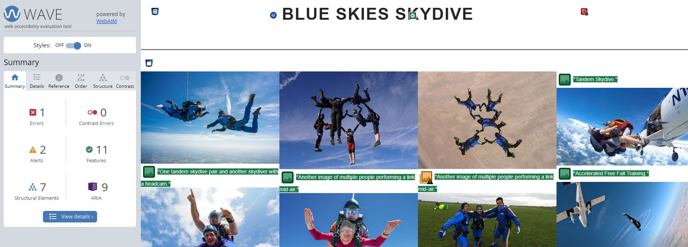

# Blue Skies Skydive

My Project is a static website of a South African skydiving club advertising skydiving packages. It is designed to be responsive on all devices and operate in a way where users are persuaded to book a skydive here or contact the owners of the club to ask further questions.

---

## CONTENTS

* [User Experience](#user-experience-ux)
  * [User Stories](#user-stories)

* [Design](#design)
  * [Colour Scheme](#colour-scheme)
  * [Typography](#typography)
  * [Imagery](#imagery)
  * [Wireframes](#wireframes)

* [Features](#features)
  * [General Features on Each Page](#general-features-on-each-page)
  * [Future Implementations](#future-implementations)
  * [Accessibility](#accessibility)

* [Technologies Used](#technologies-used)
  * [Languages Used](#languages-used)
  * [Frameworks, Libraries & Programs Used](#frameworks-libraries--programs-used)

* [Deployment & Local Development](#deployment--local-development)
  * [Deployment](#deployment)
  * [Local Development](#local-development)
    * [How to Fork](#how-to-fork)
    * [How to Clone](#how-to-clone)

* [Testing](#testing)

* [Credits](#credits)
  * [Code Used](#code-used)
  * [Content](#content)
  * [Media](#media)
  * [Acknowledgments](#acknowledgments)

---
## Target Audience

The target audience of this website is thrill-seeking tourists or experienced skydivers in the Cape Town area whoa re looking for somewhere convenient and beautiful to skydive. The location of the Drakenstein Mountain range and the experienced tandem-masters provide comfort and a sense of security, which is the main selling points of the club. The website includes a home image ofa  large group of skydivers in a formation along with some information explaining why someone might join, accompanied by some of the more senior experienced staff profiles to set potential customers mind's at ease. Finally there is a map showing location of the airfield, . The next page includes a masonry style gallery section in which many images of beginner activities and well experienced skydiving actions are being performed to try and grab all types of skydivers. The final page allows potential customers to see which packages are available and book now!

## User Stories

### As a first time skydiver I would like to feel safe
The character profiles of both Gerry and Blake provide satisfaction that someone who knows nothing about skydiving would be in good hands, both have extensive experience in skydiving, running multiple previous skydiving clubs and having some of the highest jump numbers in the whole of South Africa.

### Make booking and Planning easy
On the final page "Jump" it is very easy to see options available to all and book a slot. The socials bar in the footer also contains the "Windy" app which is an app used all the time in the industry as the sport is so weather dependant. WhatsApp is also included in the socials bar in which a potential customer would be able to reach out to Skydive Blue Skies having any additional questions.

### User friendly on all Devices
Using media queries in CSS I have been able to make the home page profiles adjust as nav-bar hide when required using a media query of around 850px which is the small tablet size. Using flexbox properties to adapt to wider/smaller screens to break the content down into columns instead of a row-style layout.

## Design

### Colour Scheme

 
 

I chose a blue and white colour scheme for my project as the title is Blue Skies Skydive, the pink colour contrasts well with both colours. 

### Typography 

I chose a google font for my project called Poppins, this is because of its simplicity on page and in setup. Below I have inserted an image of the font.

 

### Imagery 

The imagery chosen in my home page was a group formation of skydivers which is impressive and would entice someone who is potentially interested to make the move. In the gallery section of the website I have used a mix of tandem skydive pictures and sports skydiving images, this is to hopefully attract a clientbase of all skill levels.

### Wireframes

### Home Page

### Gallery

### Jump Page 

### Mobile View

I used Balsamiq to create my Wireframes.

## Features

### General features of each page

### Navbar

The navbar I chose to use is similar to the one used in the Love Running page, I used media queries to turn the navbar options into a hamburger icon witha  toggle on smaller screens. The active page of the website the user is on is signified by an underline using CSS.

Desktop version of the navbar

iPhone SE navbar view, this was the smallest screen size available to me without going responsive and shrinking manually.

### Footer with social media icons

I added in 4 icons to the footer of my page, 3 of which are social media. One for WhatsApp where instant messaging to the team would take place, one for instagram where there would be a club account posting highlights and stories proving how active the club is or celebrating achievments, and thirdly, one for YouTube where a similar highlight reel would exist. Finally the last footer icon is for an app called windy, this is an app widely used in the industry and shows the wind in the current location as this sport is very dependant on weather. All icons were sourced from font-awesome, I used a grey colour for the icons as this looks clean in my opinion.

## Features by page

### Home Page

The home page includes a short explanation as to why a potential skydiver would want to jump with Skydive Blue Skies using the location of the beautiful Drakenstein mountain range combined with the high amount of experience the jump staff have. The home page also includes some character profiles of the Chief Instructor and a little bit about him as well as another member of staff who also holds a considerably high amount of jumps. This is to try and make the potential customer feel that they are in safe hands since the staff have spent their lives doing this. I have also included a PASA number which is the Parachute Association of South Africa ina  hyperlink for both profiles. Finally a map is included as the destination is remote since it is a skydiving opoeration and cannot take place without a remote airfield, this is to help clients get to the place without issues.

### Gallery Page

The gallery page features a masonry style group of images which is responsive on different devices, the column count changes when a device is smaller since the image needs to be visible, therefore on a mobile phone there is only one column with all photos. 

Gallery on desktop view

Gallery on iPhone SE view.

### Jump page

The jump page has a background image of a tandem skydive, it also contains a form with a rgba value making the form slightly translucent. There are several radio buttons to choose from for different packages that are offered. The form requires an email, a first and last name to then be sent to a form dump when the book now button is pressed.

### Future Implementations

I would like to include a extra information button when hovered shows more information about the packages offered in the form, I have seen this done elsewhere and it looks great. Another implementation I would include is on the windy app I would set the place to be in the location of the airfield as this is the weather that matters.

### Accessibility

I have made use of aria-labels for screen readers and did the best I could to use semantic elements so that the page was easy to navigate and understand. I also added labels for all images. 

## Technologies used

**Github** - Used for storage of my site and for publishing online.\
**GitPod** - The IDE used for editing my site and pushing changes.\
**CSS** - CSS was used to style the website and define fonts and layout.\
**Python** - Used python 3 via terminal to preview my site using a local http server.\
**Google Maps** - Google maps embed from Google inc.\
**Font Awesome** - Social Media icons from Font Awesome.\
**Google Chrome** - The website was built and tested in google Chrome.\
**Google Fonts** - Used to embed a different more attractive font. \

### Languages Used

HTML, CSS, Javascript

### Frameworks, Libraries & Programs Used

**Github** - I used GitHub for the storage of my site and Gitpages to pubish my website.\

## Deployment & Local Development

### Deployment

I deployed my page on git pages, using github I found my repository I wanted to deploy and went to settings, I amde sure my source was set to 'Deploy from Branch', main branch is selected and Folder is set to / (root). Then under Branch I clicked Save, after a few minutes I went to environments and I went to 'github-pages'. On view deployment I saw that my site was live at https://rourkew.github.io/BlueSkies/

### Local Development

#### How to Clone

1. Log onto GitHub.
2. Go to the repository of the Blue Skies Project RourkeW/BlueSkies/
3. Click the green code button and copy the preferred code link. 
4. Open the terminal in your chosen code editor and change the working directory to the location desired for the clone directory.
5. Type 'git clone' into the code terminal and paste the link from the green code button you copied earlier.

#### How to Fork

1. Log in to GitHub.
2. Find the repository for the Blue Skies Project RourkeW/BlueSkies/
3. Click Fork.

## Testing

## Manual Testing

### Jigsaw CSS Validator

[Jigsaw](https://jigsaw.w3.org/css-validator/validator) was used to validate the CSS code
 - Pass

### W3C Validator

[W3C](https://validator.w3.org/nu/) was used to validate the HTML on all pages of the website.

 - Pass

### Wave Evaluation Tool

I used a Chrome extension my Merntor told me about called Wave to evaluate to page. It has one error showing for the empty label because of the burger icon but this is how Code Institue wants you to do it for now. There are also some contrast flags however this does not effect the websites integrity I feel.

### Home Page

### Gallery

### Jump Page